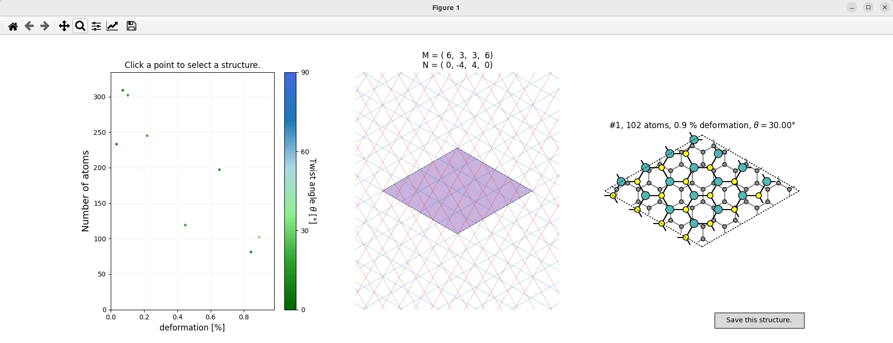

# Hetbuilder - builds heterostructure interfaces

Builds 2D heterostructure interfaces via coincidence lattice theory.

## Installation

### Build-time dependencies

Requires a C++17 compiler and [cmake](https://cmake.org/).

It is also recommended to preinstall [spglib](https://atztogo.github.io/spglib/python-spglib.html) and [pybind11](https://github.com/pybind/pybind11).
Otherwise, these will be built during the installation from the submodules.

#### Installing with pyenv, venv, or virtualenv etc.

```bash
$ sudo apt update && sudo apt install -y build-essential git pip cmake python3-dev python3-tk pybind11-dev libsymspg-dev
$ git clone https://github.com/hongyi-zhao/hetbuilder.git && cd hetbuilder
$ pyenv shell 3.11.1
$ pyenv virtualenv hetbuilder
$ pyenv shell hetbuilder
$ pip install -r requirements.txt
$ pip install .  
```

#### Development Installation with pyenv, venv, or virtualenv etc.

Download or clone the github repository. Then, `cd` to the repository and
```bash
$ pip install -r requirements.txt
$ mkdir build
$ cd build
$ cmake .. && make
$ cp hetbuilder_backend.*.so ../hetbuilder/
$ cd .. && pip install -e .
```

## Usage via CLI

The installation exposes a multi-level [typer](https://github.com/tiangolo/typer) CLI utility called `hetbuilder`:

```bash
$ hetbuilder --help
```

The `build` utility is fully implemented.
You can use any ASE-readable structure format to specify the lower and upper layer. They should be recognizable as two-dimensional, e.g., by having a zero vector in the *z*-direction.

```bash
$ cd tests
$ hetbuilder build -t0.15 graphene.xyz MoS2_2H_1L.xyz
```

This should open a [matplotlib](https://matplotlib.org/) interface looking like this:




## Documentation

Documentation is available at [Read the Docs](https://hetbuilder.readthedocs.io/en/latest/index.html).

## Testing

Tests can be run in the project directory with

```bash
$ pytest -v tests
```

## Citing

If you use this tool, please cite 10.5281/zenodo.4721346.

## Requirements

- [Atomic Simulation Environment](https://wiki.fysik.dtu.dk/ase/)
- [Space Group Libary](https://atztogo.github.io/spglib/python-spglib.html)
- [SciPy](https://www.scipy.org/)
- [matplotlib](https://matplotlib.org/)
- [pybind11](https://github.com/pybind/pybind11)
- [typer](https://github.com/tiangolo/typer)

